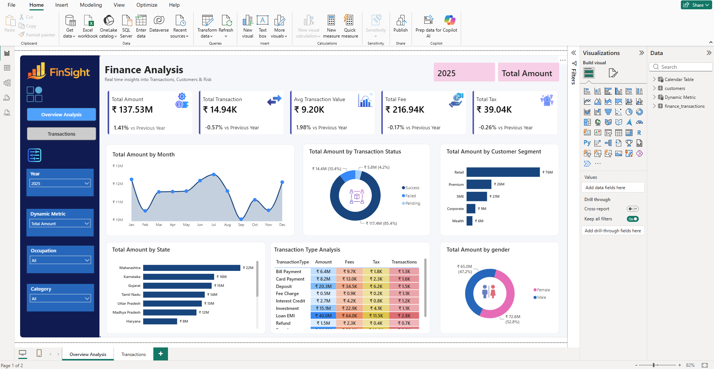
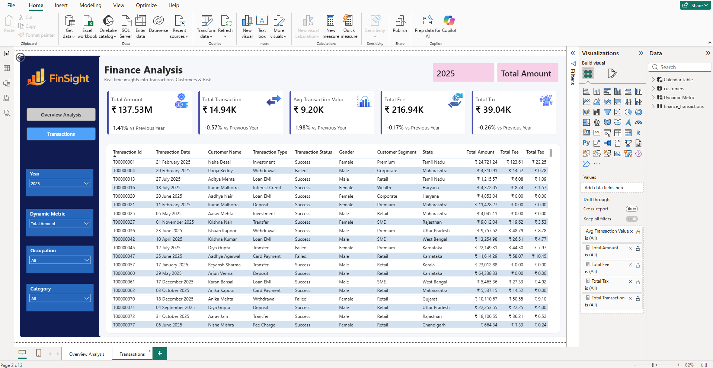

# Finance Analytics Dashboard | Power BI

## Project Overview

This project is an interactive Finance Analytics Dashboard developed using Power BI.

The dashboard provides a centralized view of financial transactions, customer behaviour, fees, taxes, and transaction performance across different business segments and regions.

The project was developed based on defined business requirements to help stakeholders monitor financial performance, identify trends, analyse customer segments, and support better financial decision-making.

## Business Problem

The organization needed a centralized analytical solution to monitor financial transactions and understand overall financial performance.

The key challenges included tracking:

- Overall transaction growth and financial performance
- Monthly transaction trends
- Successful, failed, and pending transactions
- Customer segment contribution
- State-wise financial performance
- Transaction type profitability
- Gender-based customer analysis
- Year-over-Year (YoY) performance changes

## Project Objectives

The dashboard was designed to help stakeholders:

- Monitor key financial KPIs
- Identify high-performing customer segments and states
- Analyse transaction patterns and trends
- Track operational fees and taxes
- Understand customer demographics
- Improve financial decision-making and business strategy

## Key KPIs

The dashboard includes the following key performance indicators:

- **Total Amount** – Total transaction amount processed, including YoY growth comparison
- **Total Transactions** – Total number of transactions performed
- **Average Transaction Value** – Average amount per transaction
- **Total Fees** – Total fees collected from transactions
- **Total Tax** – Total tax generated from transactions

## Dashboard Analysis

The dashboard provides analysis across the following areas:

- Monthly transaction amount trends
- Transaction status analysis
- Customer segment contribution
- State-wise financial performance
- Transaction type analysis
- Gender-wise transaction analysis
- Year-over-Year (YoY) performance

## Interactive Features

Users can dynamically filter the dashboard using:

- Year
- Dynamic Measure
- Occupation
- Category

The dashboard also includes interactive navigation and a detailed grid view with drill-down to underlying transaction records.

## Tools & Technologies

- **Power BI** – Dashboard development and data visualization
- **Power Query** – Data transformation and preparation
- **DAX** – Measures and analytical calculations

## Skills Demonstrated

- Data Cleaning and Transformation
- Data Modeling
- DAX Calculations
- Interactive Dashboard Development
- Data Visualization
- KPI Development
- Business Requirement Analysis
- Drill-down Analysis

## Dashboard Preview

### Overview Analysis

### Transaction Analysis

